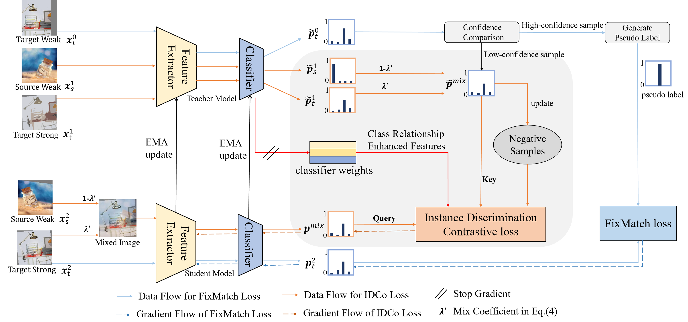

# Towards effective instance discrimination contrastive loss for unsupervised domain adaptation
This is the source code of our proposed method ICCV2023 paper "Towards effective instance discrimination contrastive loss for unsupervised domain adaptation".





## Project structure

The project structure is presented as follows

```
|ICCV2023/
├──configs
| ├──_base_
| ├──fixmatch_srcmix_officehome
| ├──fixmatch_srcmix_gvb_officehome
├──data
├──runs
├──clsda
| ├──loader
| ├──models
| ├──runner
| ├──trainers
├──experiments
```

**config**: training configs files for different experiments

**data**: contain dataset images and labels

**runs**: automatically created which stores checkpoints, tensorboard and text logging files

**clsda**: source code of our method

**experiments**: training scripts

Below are the structure under **data**.

```
│officehome/
├──Art/
│  ├── Alarm_Clock
│  │   ├── 00001.jpg
│  │   ├── 00002.jpg
│  │   ├── ......
│  ├── Backpack
│  │   ├── 00001.jpg
│  │   ├── 00002.jpg
│  │   ├── ......
│  ├── ......
├──Clipart/
│  ├── Alarm_Clock
│  │   ├── 00001.jpg
│  │   ├── 00002.jpg
│  │   ├── ......
│  ├── Backpack
│  │   ├── 00001.jpg
│  │   ├── 00002.jpg
│  │   ├── ......
│  ├── ......
│txt/
├──officehome/
│  ├── labeled_source_images_Art.txt
│  ├── unlabeled_target_images_Clipart_0.txt
|  ├── unlabeled_target_images_Clipart_1.txt
|  ├── unlabeled_target_images_Clipart_3.txt
```

## Core files

1. Model definition:  

   ./clsda/models/cls_models/srcmix_contrastive_model.py (for SSDA)

   ./clsda/models/cls_models/gvb_srcmix_contrastive_model.py (for UDA)

2. Training process: 

   clsda/trainers/trainer_fixmatch_srcmix.py (for SSDA)

   ./clsda/trainers/trainer_fixmatch_gvb_srcmix.py (for UDA)
   
3. Loss Definition

   Our contrastive loss is defined within each trainer, such as [contrastive_loss]((https://github.com/zhyx12/EIDCo/blob/74fbc437962911f9c4c64ab6712820c3e16f8492/clsda/trainers/trainer_fixmatch_hda_srcmix.py#L339)) in trainer_fixmatch_hda_srcmix.py file.


## Training scripts

```
CUDA_VISIBLE_DEVICES=0,1 bash ./experiments/scripts/uda_fixmatch_gvb_srcmix_train.sh exp ./configs/gvb/gvb_officehome_A_C_fixmatch_nce.py
```


## Citing EIDCo

```
@inproceedings{zhang2023eidco,
  title={Towards effective instance discrimination contrastive loss for unsupervised domain adaptation},
  author={Zhang, Yixin and Wang, Zilei and Li, Junjie and Zhuang, Jiafan and Lin, Zihan},
  booktitle={Proceedings of the IEEE/CVF International Conference on Computer Vision},
  pages={11388--11399},
  year={2023}
}
```

